# **SET UP ARCHITECTURE GITOPS BASIC** 

## **CLONE PROJECT BY LINK**

[**https://github.com/tuananh281/devops-project.git**]

## PROVISION VM ON MS AZURE
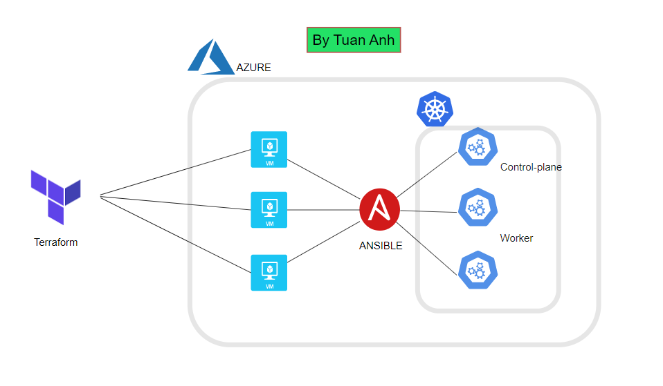

***The first, you can genarate ssh publickey and privatekey, move to cloned folder and copy private_key to ansible folder and copy file private_key to folder ansible***

1. Set permision for 2 key ssh
>On Linux and Mac: **chmod 400 key_name** 

>On Windows: **right-click key -> Properties -> Security -> Advanced -> Disable inher.... -> OK -> Edit -> Add -> username my device -> OK** 
1. Edit information on file terraform.tfvars
   
   You need to edit your information
   
   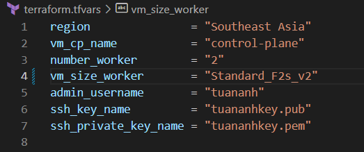
2. Run terraform
>terraform init

Apply code  to provisioning VM in Azure

>terraform apply --auto approve

or 

>terraform plan -out tfplan

>terraform apply tfplan 

3. Get public IP of VM after apply
   
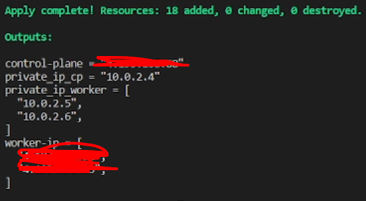

4. Connect to VM
>Access the directory without ssh key:

>ssh -i private_key_name username@public_ip

5. Set up connect ansible
   
Run command

      ssh-agent bash
      ssh-add /home/k8s/ansible/private_key.pem
      ssh-copy-id <ip_private_worker1,2>

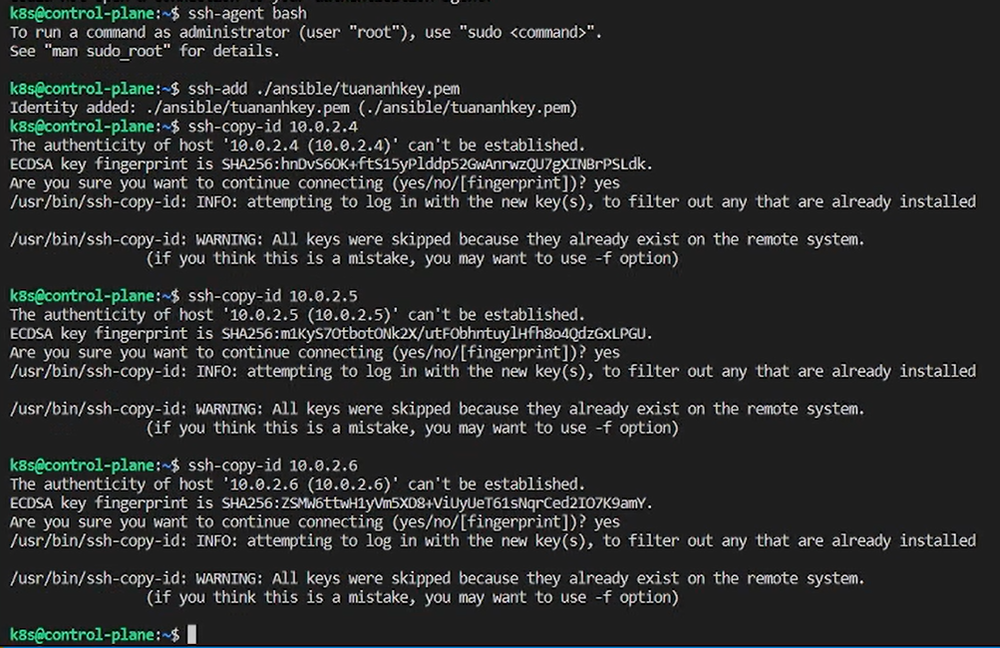

Edit inventory file on Ansible folder, get ip_private of VM and run command

      sed -i "s+cp ansible_host=control_plane_ip+cp ansible_host=**ip**+g" ./ansible/inventory
      sed -i "s+worker1 ansible_host=worker_1_ip+worker1 ansible_host=**ip**+g" ./ansible/inventory
      sed -i "s+worker2 ansible_host=worker_2_ip+worker2 ansible_host=**ip**+g" ./ansible/inventory

Check inventory file

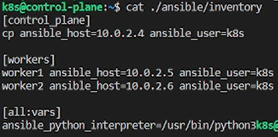

6. Create cluster k8s

- Check connect on ansible:
      
      ansible -i ./ansible/inventory -m ping all

- Install dependencies, access to folder anible you run command
      
      ansible-playbook -i inventory install_kube_dependenci.yml

- Create cluster on control-plane
  
      ansible-playbook -i inventory create_cluster.yml

- Join cluster from worker

      ansible-playbook -i inventory join_cluster.yml

- Check cluster is ready
  
      watch kubectl get node

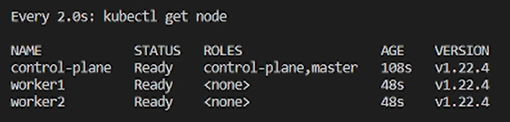

## SETUP GITOPS WITH ARGOCD ON K8S

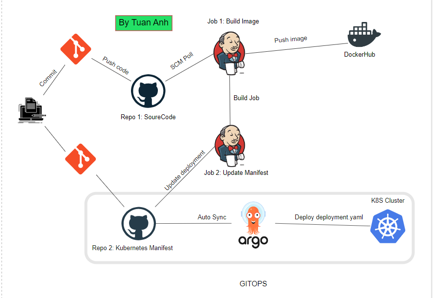

1. Install Jenkins on cluster

**You can setup jenkins outside k8s**

reference link:

      https://www.jenkins.io/doc/book/installing/
      https://www.youtube.com/watch?v=d2-HXYKjfbc&ab_channel=KSPM-K%E1%BB%B9S%C6%B0Ph%E1%BA%A7nM%E1%BB%81m

Install plugin on Jenkins:
**Manage Jenkins -> Manage Plugins -> Available plugins**

Chose plugin: Docker, Docker Pipeline and Github.

Install without

2. Install argocd

         kubectl create namespace argocd
         kubectl create namespace deploy-argocd
         kubectl apply -n argocd -f https://raw.githubusercontent.com/argoproj/argo-cd/stable/manifests/install.yaml

Edit service argocd-server of argocd 

      kubectl edit svc argocd-server -n argocd

      >>type ClusterIP  >> NodePort

Get port of service argocd-server

      kubectl get svc -n argocd

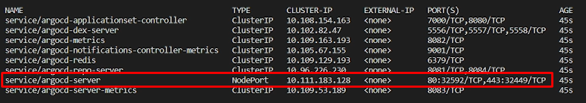

1. Install argocd-cli

         sudo curl -sSL -o /usr/local/bin/argocd https://github.com/argoproj/argo-cd/releases/latest/download/argocd-linux-amd64
         sudo chmod +x /usr/local/bin/argocd

Check version of argocd cli

      argocd version

3. Login ArgoCD

user: admin

Get password of ArgoCD

      kubectl -n argocd get secret argocd-initial-admin-secret -o jsonpath="{.data.password}" | base64 -d; echo

login web
>http://public_ip_control_plan:port

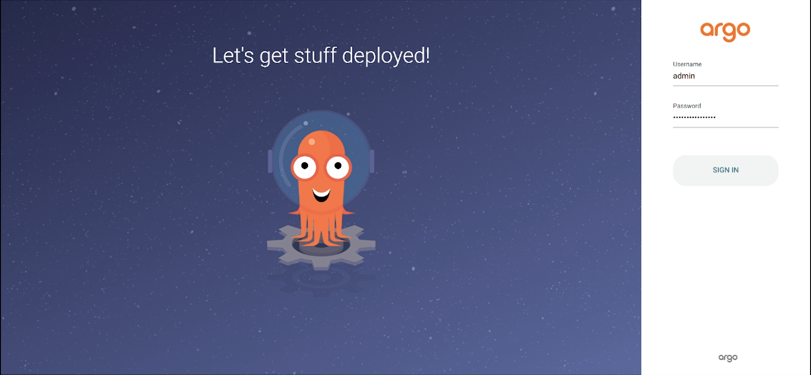

login cli
>argocd login public_ip_control_plane:port

4. Setup on Jenkins

Create Credential for github and dockerhub

**Manage Jenkins -> Manage Credentials -> Global -> Add Credentials**

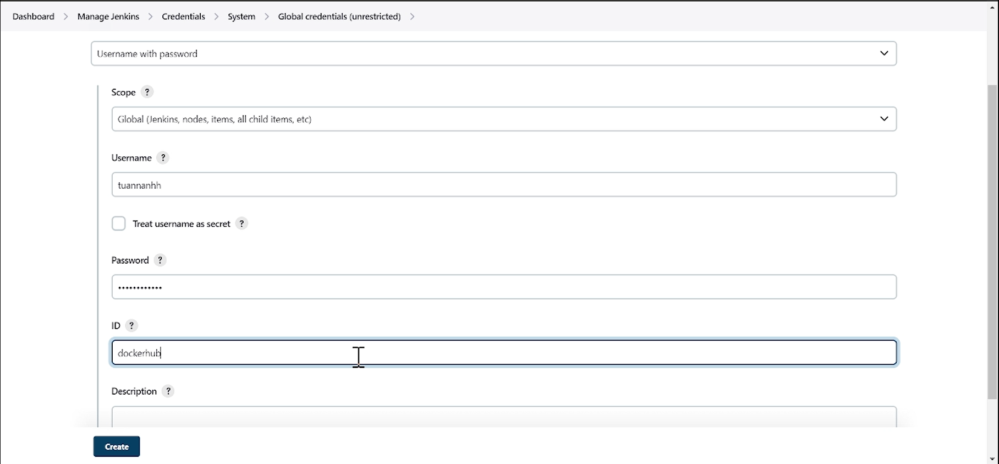

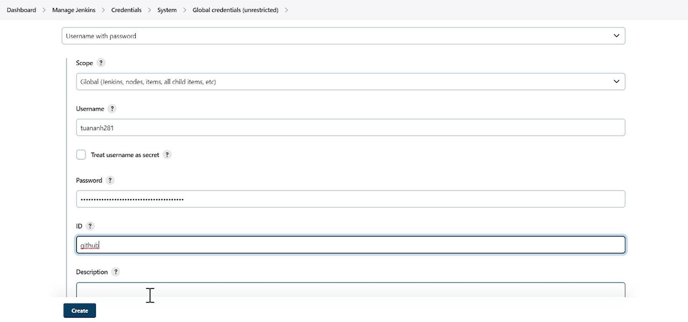

*You can generate token from your github repo and add token to password*

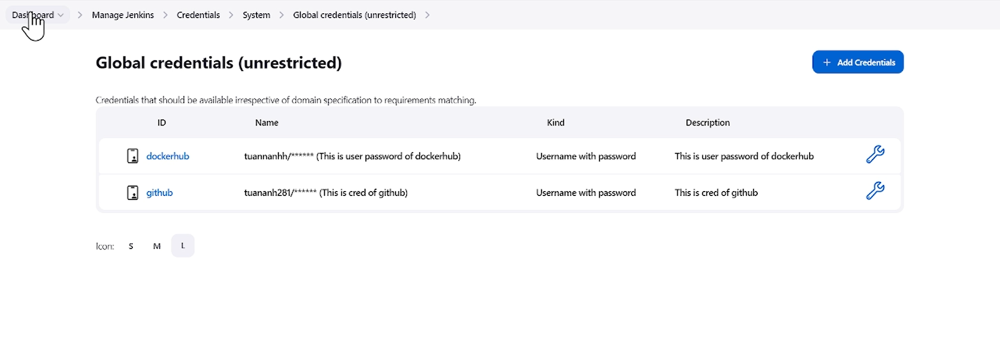

## Create JOB 1: Build image and push image to repo dockerhub ##

**Dashboard -> New Item -> Item name ... -> Pipeline -> OK**

**GitHub project**

      Project URL: https://github.com/tuananh281/train-schedule.git
      GitHub hook trigger for GITScm polling

**Definition -> Pipeline script from SCM -> Git**

      URL Project: https://github.com/tuananh281/train-schedule.git
      branch: main
      Script Path: Jenkinsfile
-> Save

## Create JOB 2: Get paramester from JOB 1 and update manifest to GitHub ##

**Dashboard -> New Item -> Item name: update-manifest-github -> Pipeline -> OK**

**This project is paramesterized -> Add Paramester -> String Paramester**
   
      Name: DOCKERTAG
      Value: latest

**Definition -> Pipeline script from SCM -> Git**

      URL project: https://github.com/tuananh281/deploy-argocd.git
      branch: main
      Script Path Jenkinsfile

## Setup webhook from github (CI)

**Access to github on JOB 1 -> setting -> Webhooks -> Add webhook**

      Payload URL: http://ip_public_jenkins:port/github-webhook/
      Content type: application/json
      Just the push event.

**Every time we push code to the github repo, github will receive the event and will call Jenkins to update, this is the CI process.**

5. Setup ArgoCD

Access ArgoCD by browser

**NEW APP -> write information...**

      Application Name: demogitops

      Project Name: default

      Sync Policy: Automatic

      Repository URL: https://github.com/tuananh281/deploy-argocd.git

      Path: .

      Cluster URL: ...default.svc

      Namespace: deploy-argocd

      ->Create

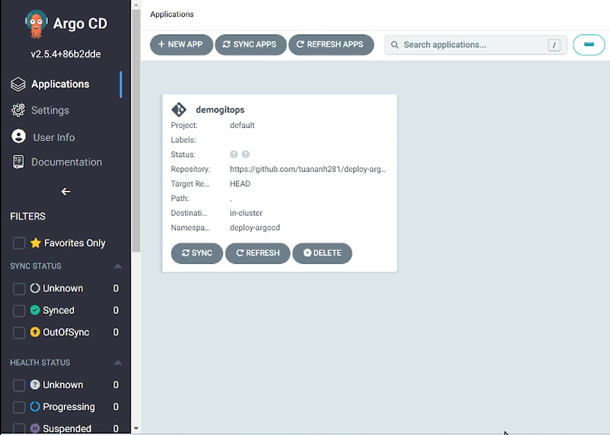

6. Process of implementation

**After commit and push code to github repo 1, Jenkins will run Job 1 build image, add tag for image and push image to dockerhub, end Job 1, run Job 2 update new version of image on deployment.yaml . After a period of time, ArgoCD will sync to github repo 2 and deploy deployment file to k8s cluster**

- Run JOB 1 on Jenkins
 
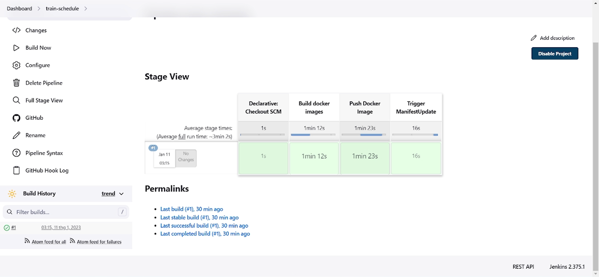

- Run JOB 2 on Jenkins

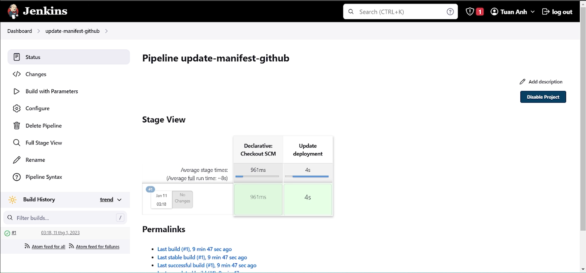

- ArgoCD sync to github repo

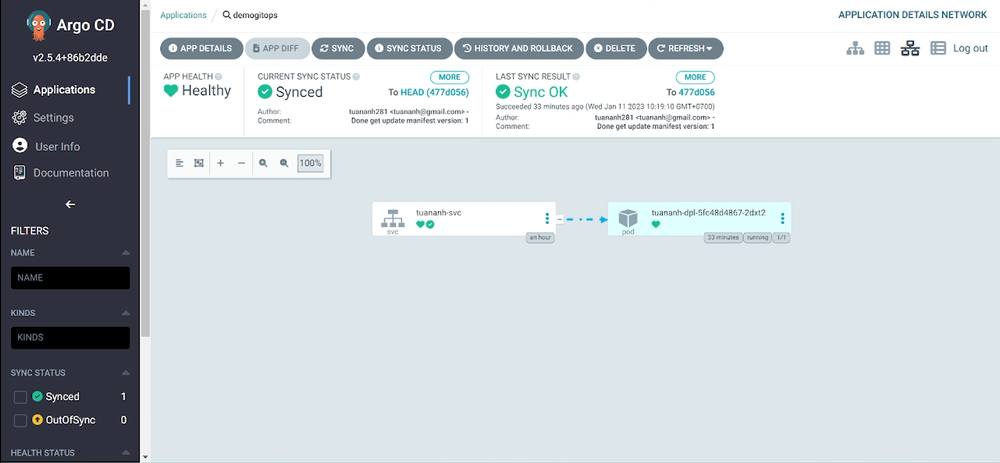

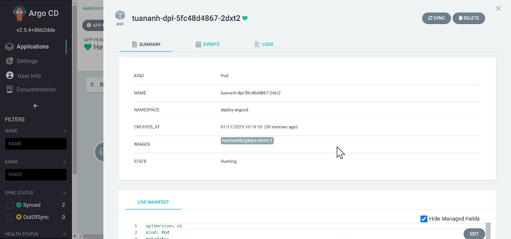

Get the port service of the deployment that has just been deployed
   kubectl get all -n deploy-argocd

# Result 

Access by browser: http://ip_public_control-plane:port

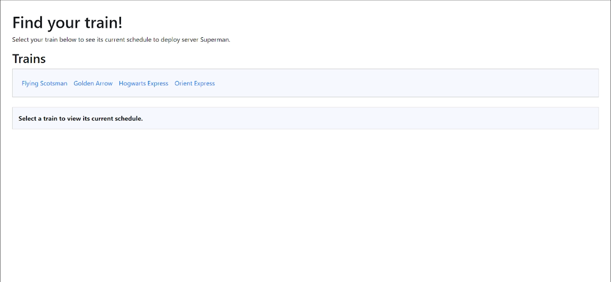

You can edit file index.jade on folder views to test pipeline CICD

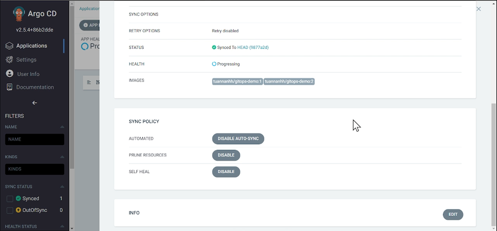

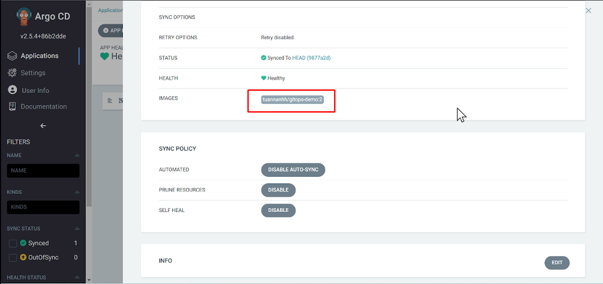

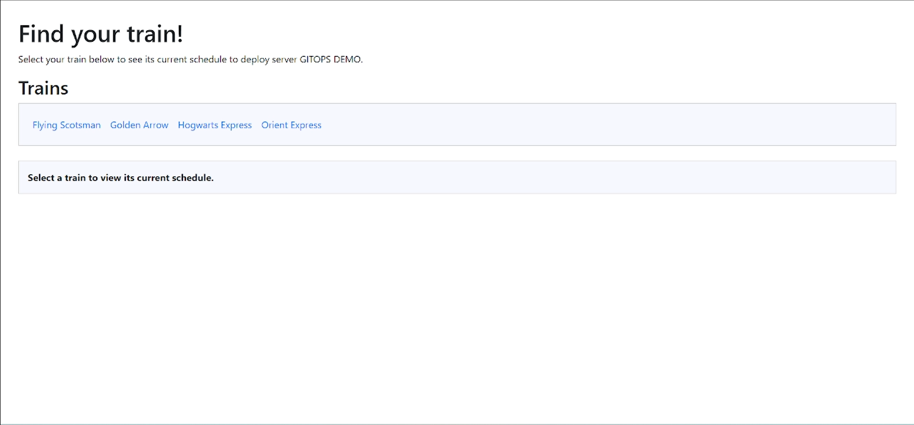

## THE END.
